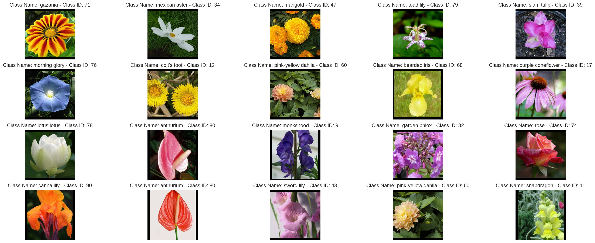

# Flower_Recognition
Flower species recognition. This is the final project for the Facebook/Udacity PyTorch Schollarship Challange.

In this project, I used a pre-trained VGG16 model to extract the feautues of the input images to classify each flower to their respected category.

After traning the model with 50 epochs, the model gained an 87% accuracy.

Below is an example of the flower dataset with their respective species and class id.

The image below shows a prediction test on the trained model, in which the green labels means correct and the red labels incorrect.

